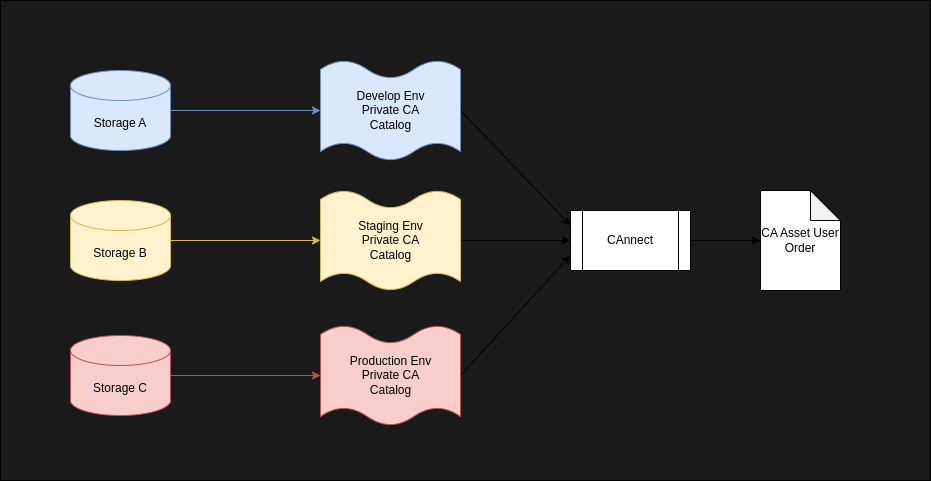

# CAnnect
[](https://github.com/yuxki/cannect/actions/workflows/test.yaml)
[](https://codecov.io/gh/yuxki/cannect)

## Introduction
CLI tool that facilitates the organization and management of private Certificate Authority (CA)
assets in development, staging, and production environments for users.



## Download
- Get the latest binary from [releases](https://github.com/yuxki/cannect/releases).
- Or get the sources:
```
git clone https://github.com/yuxki/cannect
```

## Example
For example, a CA user (server) may read a certificate from the `examples/cert`
directory. Furthermore, the server needs to create its own certificate chain that
includes the root CA certificate and the certificates of its sub-CAs.

First, prepare a `catalogs` file in JSON format that defines the assets to be managed by the private CA.
It is assumed that this file will be prepared for each private CA environment.
Assume that the `examples/store` directory is where the CA stores the certificates.
##### examples/catalog.json
```JSON
{
  "catalogs": [
    {
      "alias": "root-ca.crt",
      "uri": "file://examples/store/root-ca.crt",
      "category": "certificate"
    },
    {
      "alias": "sub-ca.crt",
      "uri": "file://examples/store/sub-ca.crt",
      "category": "certificate"
    },
    {
      "alias": "server.crt",
      "uri": "file://examples/store/server.crt",
      "category": "certificate"
    }
  ]
}
```

Next, create an order file in JSON format. This file specifies the CA
assets required by the user (server). To refer to the assets
defined in the catalog file, an alias must be specified. Multiple sets of aliases can
also be used to create a certificate chain.
Assume that the `examples/certs` directory is where the server reads.
##### examples/order.json
```JSON
{
  "orders": [
    {
      "aliases": [
        "root-ca.crt"
      ],
      "uri": "file://examples/certs/root-ca.crt"
    },
    {
      "aliases": [
        "sub-ca.crt"
      ],
      "uri": "file://examples/certs/sub-ca.crt"
    },
    {
      "aliases": [
        "root-ca.crt",
        "sub-ca.crt",
        "server.crt"
      ],
      "uri": "file://examples/certs/server.crt"
    }
  ]
}
```

Then, run the `connect` command. The `-catalog` option receives the
 catalog file and the `-order` option receives the order file.
```bash
mkdir examples/certs # create for doing example
cannect -order examples/order.json -catalog examples/catalog.json
```
## CLI Usage
```
Usage: cannect <OPTIONS>
  OPTIONS
    -catalog <file-path> The path of catalog file. (required: Exclusive to -catalog-order)
    -order <file-path> The path of order file. (required: Exclusive to -catalog-order)
    -catalog-order <file-path> The path of file contains both orders and catalogs. (required: Exclusive to -catalog and -order)
    -env-out <file-path> The path of env scheme output. (default: ./cannect.env)
    -con-limit <number> The path of env scheme output. (default: ./cannect.env)
    -timeout <number> The number of seconds for timeout. (default: 30)
```

Specify an catalog file and a order file with each option.
```
cannect -order order.json -catalog catalog.json
```

Specify a file that contains both `catalogs` and `orders`.
```
cannect -catalog-order catalog.json
```

## Data Definition
### Catalog file top level
|Key|Description|
| -------- | -------- |
|`catalogs`|List of catalog element.|

#### Catalog element
|Key|Description|
| -------- | -------- |
|`alias`|Alias of this catalog. The order element uses this to select a CA asset.|
|`uri`|[URI](#URIs) CAnnect defined and supported.|
|`category`|CA asset category. The available options are "certificate", "privateKey", "encPrivateKey", "crl".|

#### Example
```JSON
{
  "catalogs": [
    {
      "alias": "ca-one-crt",
      "uri": "file://path/to/ca/ca-one.crt",
      "category": "certificate"
    },
    {
      "alias": "ca-two-key",
      "uri": "file://path/to/ca/ca-two.key",
      "category": "privateKey"
    },
    {
      "alias": "root-ca-crt",
      "uri": "github:///repos/yuxki/cannect/contents/examples/store/root-ca.crt",
      "category": "certificate"
    },
  ]
}
```

### Order file top level
|Key|Description|
| -------- | -------- |
|`orders`|List of order element.|

#### Order element
|Key|Description|
| -------- | -------- |
|aliases|List of `alias` defined in the catalog element.|
|`uri`|[URI](#URIs) CAnnect defined and supported.|

#### Example
```JSON
{
  "orders": [
    {
      "aliases": [
        "ca-one-crt"
      ],
      "uri": "file://path/to/server/cert/config/dir/ca.crt"
    },
    {
      "aliases": [
        "ca-two-crt"
      ],
      "uri": "env://CERTIFICATE_ENV"
    }
  ]
}
```

## URIs
### Local File System
- Scheme
    - "file"
- Path
    - Path to file.
#### Support
|catalog|order|
| -------- | -------- |
|✔|✔|

#### Example
```
file://path/to/server/cert/config/dir/ca.crt
```

### Environment Variable
When it is used in order, it creates a file that contains `export key=content`.
(Default path is "./cannect.env")\
The user may run this file using the `source` or `.` command to set the
environment variable.

- Scheme
    - "env"
- Path
    - Name of environment variable.
#### Support
|catalog|order|
| -------- | -------- |
||✔|
```
env://CERTIFICATE_ENV
```

### GitHub
Get the content of CA assets from the GitHub repository using the GitHub Get
Repository Content API.

- Scheme
    - "github"
- Path
    - Path of in [Repository Content API](https://docs.github.com/en/rest/repos/contents?apiVersion=2022-11-28) format.
#### Support
|catalog|order|
| -------- | -------- |
|✔||
```
github:///repos/yuxki/cannect/contents/examples/store/root-ca.crt
```

## Limitation
- Support only PEM format.
